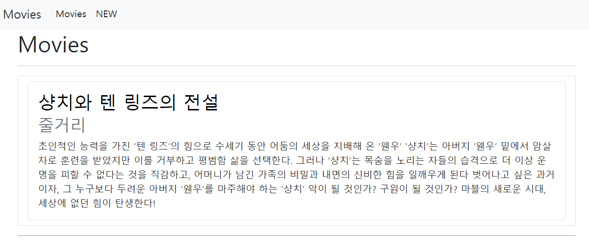
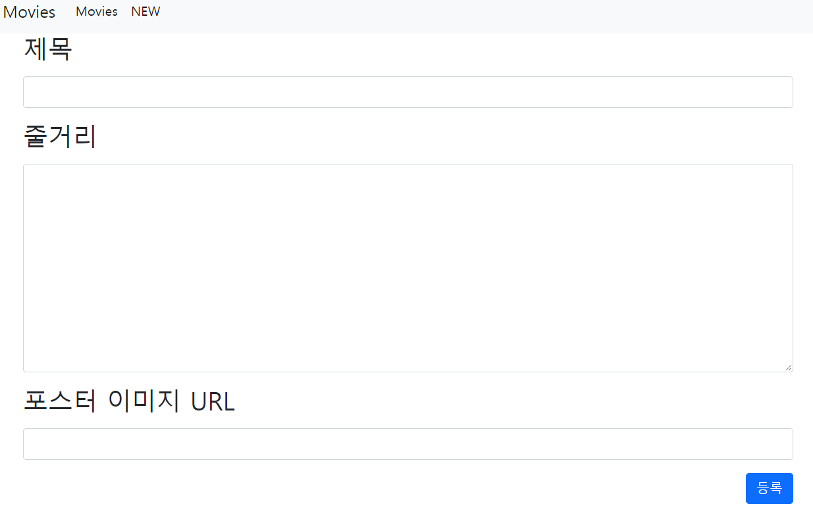
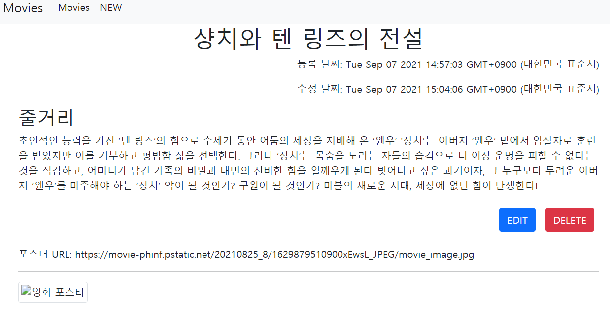

# SSAFY Django pjt01 express version 

## Django migration 과 sequelize.js 비교

- [sequelize 홈페이지](https://sequelize.org/master/index.html)
- [victolee 님의 2017년 sequelize 정리](https://victorydntmd.tistory.com/26?category=677306)
- `orm` 은 Object Relational Mapping 으로 객체와 관계형 데이터베이스를 자동으로 매핑해준다

  - 장점 
    1. 데이테베이스 의존성을 줄인다
    2. orm 이 독립적으로 사용되어 재사용 및 유지보수가 편리하다
    3. 생산성이 향상된다

  - 단점
    1. 매핑 과정에서 시간이 소요된다
    2. `orm` 만으로 복잡한 SQL 문을 작성하기 쉽지 않다

### Sequelize CLI

- Sequelize 는 node.js 기반 ORM 으로  Promise  문법을 사용한다
- `npm install -g sequelize-cli`

####  명령어

- `sequelize init`: config, migrations, model, seeders 폴더가 생성된다

  config.json 파일에는 DB 연결 정보를 설정한다

  ```json
  {
    "development": {
      "dialect": "sqlite",
      "storage": "development.db"
    },
    "test": {
      "dialect": "sqlite",
      "storage": "test.db"
    },
    "production": {
      "dialect": "sqlite",
      "storage": "production.db"
    }
  }
  ```

  ```js
  // app.js db 연결 과정
    async setDB() {
      try {
        await models.sequelize.sync()
        console.log('Connection has been established successfully.')
      } catch (err) {
        console.error('Unable to connect to the database:', err)
      }
    }
  ```

- model 및 migration file 생성 방법

  ```bash
  $ sequelize model:generate --name TABLE_NAME --attributes "COLUMN1:type, COLUMN2:type, COLUMN3:type"
  ```

- migration 명령어 비교

  |         명령어         |                            Django                            |                    Sequelize                     |
  | :--------------------: | :----------------------------------------------------------: | :----------------------------------------------: |
  | 마이그레이션 파일 생성 |          python manage.py makemigrations <app-name>          | sequelize migration:generate --name  <file-name> |
  |   마이그레이션 실행    |             python manage.py migrate <app-name>              |               sequelize db:migrate               |
  |   마이그레이션 취소    | python manage.py migrate <app-name> <previous migration number> |            sequelize db:migrate:undo             |

#### 모델

```js
'use strict'
const { Model } = require('sequelize')
module.exports = (sequelize, DataTypes) => {
  class movie extends Model {}
  movie.init(
    {
      title: {
        type: DataTypes.STRING(100),
        unique: true,
      },
      overview: DataTypes.TEXT,
      posterPath: DataTypes.STRING(100),
    },
    {
      sequelize,
      modelName: 'movie',
    }
  )
  return movie
}
```

```python
from django.db import models
from django.db.models.fields import CharField, DateField, TextField

# Create your models here.


class Movie(models.Model):
    title = CharField(max_length=100)
    overview = TextField()
    poster_path = CharField(max_length=500)
    created_at = DateField(auto_now_add=True)
    updated_at = DateField(auto_now=True)

    def __str__(self) -> str:
        return self.title

```

## 화면







